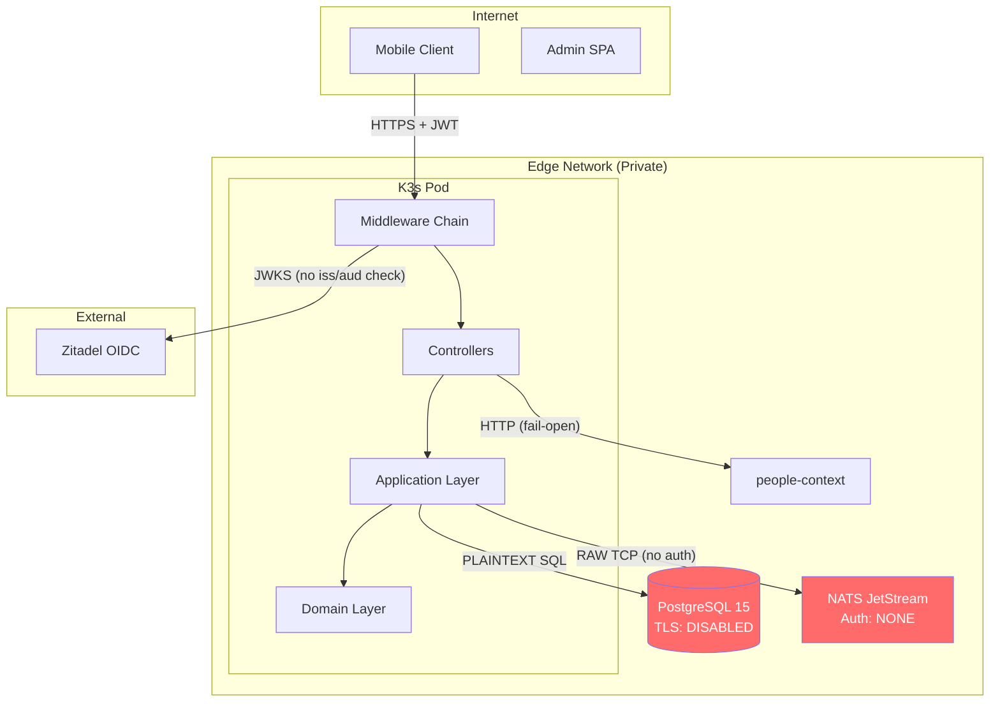

# Full Security Assessment — social-care (Swift 6.2 / Vapor 4)

**Date**: 2026-04-11
**Lead**: security-orchestrator
**Agents Used**: 6/6
**Scope**: `social-care/Sources/social-care-s/` (Domain, Application, IO), Dockerfile, CI/CD, Dependencies

---

## Executive Summary

O servico social-care da ACDG apresenta uma **arquitetura de software solida** (Clean Architecture + DDD, strict concurrency, typed IDs, Transactional Outbox), mas possui **lacunas significativas de seguranca na camada de infraestrutura e transporte** que impedem seu uso seguro em producao. Os riscos mais criticos envolvem **comunicacao sem criptografia** (PostgreSQL e NATS sem TLS), **SQL injection** via `unsafeRaw`, **validacao JWT incompleta** (sem verificacao de issuer/audience), e **vazamento de PII em logs** (CPF em texto plano, violando LGPD). A ausencia de rate limiting, security headers, CORS e controle de acesso por recurso (IDOR) completam o quadro de vulnerabilidades que precisam de remediacao imediata.

**Postura geral: NEEDS REMEDIATION — o servico NAO esta pronto para producao.**

---

## Security Score: 48/100

### Score Breakdown

| Dimensao | Score | Max | Agente |
|----------|-------|-----|--------|
| Architecture & Design | 9 | /15 | threat-analyst |
| Code Vulnerabilities | 12 | /25 | pentest-scanner |
| Authentication & Access | 11 | /20 | auth-auditor |
| API Security | 5 | /15 | api-hardener |
| Infrastructure & DevSecOps | 7 | /15 | pipeline-security-auditor |
| Code Quality & Practices | 4 | /10 | secure-code-reviewer |

---

## Critical Findings (MUST FIX)

> Findings deduplicados e consolidados de todos os 6 agentes. Quando multiplos agentes encontraram o mesmo problema, estao creditados.

### CF-01: PostgreSQL TLS Desabilitado — PII em Texto Plano

| Campo | Valor |
|-------|-------|
| **Severidade** | CRITICAL |
| **CVSS** | 7.8 |
| **OWASP** | A02:2021 — Cryptographic Failures |
| **Arquivo** | `IO/HTTP/Bootstrap/configure.swift:15` |
| **Agentes** | threat-analyst (T001), auth-auditor (CRITICAL-03), pentest-scanner, api-hardener (F06), pipeline-auditor (CRIT-03) |

**Problema**: `tls: .disable` faz com que TODAS as queries SQL (contendo CPF, NIS, CNS, diagnosticos medicos, relatorios de violacao) trafeguem em texto plano entre o servico e o PostgreSQL.

**Correcao**:
```swift
// ANTES
tls: .disable

// DEPOIS
tls: .prefer(try .init(configuration: .clientDefault))
// Em producao: .require(...)
```

---

### CF-02: SQL Injection via `unsafeRaw` no LookupAdminRepository

| Campo | Valor |
|-------|-------|
| **Severidade** | CRITICAL |
| **CVSS** | 9.8 |
| **OWASP** | A03:2021 — Injection |
| **Arquivo** | `IO/Persistence/SQLKit/SQLKitLookupAdminRepository.swift:99-101` |
| **Agentes** | threat-analyst (T004/T005), pentest-scanner (CRITICAL) |

**Problema**: `\(unsafeRaw: table)` interpola o nome da tabela (originado da URL) diretamente em SQL raw. O allowlist existe no controller mas NAO no repositorio — qualquer novo code path que chame o repositorio sem validar abre SQL injection completo.

**Correcao**:
```swift
// ANTES
try await db.raw("UPDATE \(unsafeRaw: table) SET ativo = NOT ativo WHERE id = \(bind: id)").run()

// DEPOIS
guard AllowedLookupTables.all.contains(table) else { throw AppError(...) }
try await db.raw("UPDATE \(ident: table) SET ativo = NOT ativo WHERE id = \(bind: id)").run()
```

Tambem corrigir `SQLKitPatientRepository.swift:167-172`:
```swift
// ANTES
WHERE patient_id IN (\(unsafeRaw: patientIds.map { "'\($0.uuidString)'" }.joined(separator: ",")))

// DEPOIS
.where("patient_id", .in, patientIds)
```

---

### CF-03: JWT — Issuer e Audience Nao Verificados

| Campo | Valor |
|-------|-------|
| **Severidade** | CRITICAL |
| **CVSS** | 8.2 |
| **OWASP** | A07:2021 — Identification and Authentication Failures |
| **Arquivo** | `IO/HTTP/Auth/ZitadelJWTPayload.swift:15-17` |
| **Agentes** | threat-analyst (T003), auth-auditor (CRITICAL-01), pentest-scanner, api-hardener (F13) |

**Problema**: `verify()` so checa `exp`. Um token de QUALQUER aplicacao no mesmo Zitadel e aceito.

**Correcao**:
```swift
func verify(using algorithm: some JWTAlgorithm) async throws {
    try exp.verifyNotExpired()
    try iss.verifyIntendedRecipient(is: Environment.get("ZITADEL_ISSUER") ?? "https://auth.acdgbrasil.com.br")
    try aud.verifyIntendedAudience(includes: Environment.get("ZITADEL_PROJECT_ID") ?? "363110312318140539")
}
```

---

### CF-04: NATS sem Autenticacao nem TLS

| Campo | Valor |
|-------|-------|
| **Severidade** | CRITICAL |
| **CVSS** | 8.1 |
| **OWASP** | A05:2021 — Security Misconfiguration |
| **Arquivos** | `IO/EventBus/NATSEventPublisher.swift:64-66`, `NATSEventSubscriber.swift:59-62` |
| **Agentes** | threat-analyst (T002), pentest-scanner |

**Problema**: Conexao TCP raw sem auth (`CONNECT {"verbose":false,"pedantic":false}`) e sem TLS. Qualquer host na rede pode interceptar eventos com PII ou injetar eventos falsos no `people.person.registered`, sobrescrevendo PersonIds de pacientes.

**Correcao**:
1. Habilitar NATS auth (nkey ou token) no CONNECT
2. Usar `nats+tls://` com certificados
3. Validar schema e assinatura HMAC nos eventos inbound

---

### CF-05: CPF Logado em Texto Plano (Violacao LGPD)

| Campo | Valor |
|-------|-------|
| **Severidade** | CRITICAL |
| **CVSS** | 7.5 |
| **OWASP** | A09:2021 — Security Logging & Monitoring Failures |
| **Arquivos** | `Application/Registry/Commands/LinkPersonId/LinkPersonIdCommandHandler.swift:26,40`, `IO/HTTP/Middleware/AppErrorMiddleware.swift:52-53` |
| **Agente** | secure-code-reviewer (NEW) |

**Problema**: O CPF (dado sensivel sob LGPD Art. 5) e logado em texto plano durante o link de PersonId. Alem disso, `AppErrorMiddleware` loga `context` (que contem PII) ao inves de `safeContext`, anulando o design de separacao safe/unsafe.

**Correcao**:
```swift
// LinkPersonIdCommandHandler — mascarar CPF no log
logger.info("Linking person to patient", metadata: ["cpf": "\(cpf.prefix(3)).***.***-**"])

// AppErrorMiddleware — usar safeContext
logger.error("Request failed", metadata: ["context": "\(appError.safeContext)"])
```

---

### CF-06: Container Roda como Root

| Campo | Valor |
|-------|-------|
| **Severidade** | CRITICAL |
| **CVSS** | 5.8 |
| **OWASP** | A05:2021 — Security Misconfiguration |
| **Arquivo** | `Dockerfile` |
| **Agentes** | threat-analyst (T013), pipeline-auditor (CRIT-01) |

**Correcao**: Adicionar ao Dockerfile:
```dockerfile
RUN groupadd -r appgroup && useradd -r -g appgroup -d /app -s /sbin/nologin appuser
COPY --from=build --chown=appuser:appgroup /build/.build/release/social-care-s /app/
USER appuser
```

---

### CF-07: Credenciais de DB Hardcoded como Fallback no Binario

| Campo | Valor |
|-------|-------|
| **Severidade** | CRITICAL |
| **CVSS** | 6.0 |
| **Arquivo** | `IO/HTTP/Bootstrap/configure.swift:9-13` |
| **Agente** | pipeline-auditor (CRIT-02) |

**Correcao**: Fail-fast se env vars nao existem:
```swift
guard let dbHost = Environment.get("DB_HOST"),
      let dbUser = Environment.get("DB_USER"),
      let dbPassword = Environment.get("DB_PASSWORD"),
      let dbName = Environment.get("DB_NAME") else {
    fatalError("Required DB_* environment variables are not set.")
}
```

---

## High Findings

### HF-01: IDOR — Nenhum Controle de Acesso por Recurso

| **CVSS** | 7.5 | **Agentes** | threat-analyst (T009), auth-auditor (MED-01), pentest-scanner |
|-----------|-----|-------------|---|
| **Arquivo** | Todos os controllers | **OWASP** | A01:2021 — Broken Access Control |

Qualquer `social_worker` autenticado pode ler/modificar QUALQUER paciente. Nao existe verificacao de ownership ou assignment.

**Recomendacao**: Implementar tabela de assignment `professional_id ↔ patient_id` e validar no middleware/use-case.

---

### HF-02: NATSMessageHandler — Data Race em Buffer

| **CVSS** | 7.0 | **Agente** | secure-code-reviewer (NEW) |
|-----------|-----|------------|---|
| **Arquivo** | `NATSEventSubscriber.swift:94-99` |

`@unchecked Sendable` class com `var buffer: String` mutado em callbacks NIO sem sincronizacao.

---

### HF-03: `nonisolated(unsafe) var channel` no NATSEventPublisher

| **CVSS** | 6.5 | **Agente** | secure-code-reviewer (NEW) |
|-----------|-----|------------|---|
| **Arquivo** | `NATSEventPublisher.swift:33` |

Suprime verificacao de concurrency do Swift 6.2 em propriedade mutavel dentro de actor.

---

### HF-04: Sem Rate Limiting em Nenhum Endpoint

| **CVSS** | 6.8 | **Agentes** | threat-analyst (T008), pentest-scanner, api-hardener (F01) |
|-----------|-----|-------------|---|
| **Arquivo** | `configure.swift` middleware chain |

Permite enumeracao de pacientes, DoS via queries pesadas, e abuso de endpoints de escrita.

---

### HF-05: Sem Security Headers (HSTS, X-Content-Type-Options, Cache-Control)

| **CVSS** | 6.2 | **Agentes** | threat-analyst (T018), api-hardener (F02) |
|-----------|-----|-------------|---|

Respostas com PII podem ser cacheadas por proxies intermediarios. Sem HSTS, vulneravel a SSL stripping.

---

### HF-06: Sem CORS — Qualquer Origem Pode Fazer Requests

| **CVSS** | 5.5 | **Agente** | api-hardener (F03) |
|-----------|-----|------------|---|

---

### HF-07: Sem Body Size Limit Explicito

| **CVSS** | 5.3 | **Agente** | api-hardener (F04) |
|-----------|-----|------------|---|

DTOs com arrays (diagnoses, benefits, etc.) aceitam payloads sem limite de tamanho.

---

### HF-08: X-Build-Version Expoe SHA de Deploy

| **CVSS** | 4.5 | **Agente** | api-hardener (F05) |
|-----------|-----|------------|---|
| **Arquivo** | `AppErrorMiddleware.swift:10-11,74` |

---

### HF-09: VERBOSE_ERRORS Pode Vazar Internals em Producao

| **CVSS** | 5.6 | **Agentes** | threat-analyst (T011), api-hardener (F07) |
|-----------|-----|-------------|---|

---

### HF-10: Audit Trail Sem Paginacao — Memory Exhaustion

| **CVSS** | 5.3 | **Agentes** | secure-code-reviewer, api-hardener (F09) |
|-----------|-----|-------------|---|
| **Arquivo** | `PatientController.swift:147-161` |

---

### HF-11: No Optimistic Concurrency Control on Patient Save

| **CVSS** | 6.5 | **Agente** | secure-code-reviewer (NEW) |
|-----------|-----|------------|---|
| **Arquivo** | `SQLKitPatientRepository.swift:19-21` |

Campo `version` existe mas nunca e verificado no `save()`. Escritas concorrentes destroem dados silenciosamente.

---

### HF-12: Sem Pre-commit Secret Scanning

| **CVSS** | 5.0 | **Agente** | pipeline-auditor (SEC-01) |
|-----------|-----|------------|---|

Nenhum gate automatico para prevenir commit acidental de secrets.

---

### HF-13: docker-compose — Senha Hardcoded + Sem Security Options

| **CVSS** | 5.0 | **Agente** | pipeline-auditor (DC-01, DC-02) |
|-----------|-----|------------|---|

---

## Medium Findings

| ID | Finding | Agente(s) |
|----|---------|-----------|
| MF-01 | Token introspection aceita bearer token vazio | auth-auditor (MED-02) |
| MF-02 | `owner` role acessa todos os pacientes sem scoping | auth-auditor (MED-04), threat-analyst (T019) |
| MF-03 | Audit trail retorna PII completo no payload | threat-analyst (T010) |
| MF-04 | Sem validacao de Content-Type em endpoints de mutacao | api-hardener (F10) |
| MF-05 | Sem limite de comprimento em strings dos DTOs | api-hardener (F11) |
| MF-06 | Sem limite de tamanho em arrays dos DTOs | api-hardener (F12) |
| MF-07 | Resposta de paciente retorna agregado inteiro (over-fetching PII) | api-hardener (F14) |
| MF-08 | tableName refletido em mensagem de erro | api-hardener (F15) |
| MF-09 | Outbox relay sem dead-letter queue e sem max retries | threat-analyst (T016) |
| MF-10 | SSRF potencial via PeopleContextPersonValidator (fail-open) | pentest-scanner |
| MF-11 | CI nao roda testes antes de push da imagem | pipeline-auditor (CI-03) |
| MF-12 | Reusable workflow pinned a `@main`, nao SHA | pipeline-auditor (CI-01) |
| MF-13 | Sem container scanning (Trivy/Grype) no CI | pipeline-auditor (CI-02) |
| MF-14 | Sem SBOM generation | pipeline-auditor (SC-01) |
| MF-15 | NATS subject injection via typeName nao validado | secure-code-reviewer |
| MF-16 | NATS handshake nao valida INFO frame do servidor | secure-code-reviewer |
| MF-17 | `ApproveLookupRequestCommandHandler` nao re-valida tableName | secure-code-reviewer |

---

## OWASP Top 10 (2021) Compliance

| Category | Status | Findings |
|----------|--------|----------|
| A01: Broken Access Control | **NON-COMPLIANT** | HF-01 (IDOR), MF-02 (owner scope) |
| A02: Cryptographic Failures | **NON-COMPLIANT** | CF-01 (DB TLS), CF-04 (NATS TLS) |
| A03: Injection | **NON-COMPLIANT** | CF-02 (SQL injection via unsafeRaw) |
| A04: Insecure Design | **PARTIAL** | HF-04 (no rate limit), HF-07 (no body limit) |
| A05: Security Misconfiguration | **NON-COMPLIANT** | CF-06 (root container), HF-05 (no headers), HF-06 (no CORS) |
| A06: Vulnerable Components | **COMPLIANT** | Deps atualizadas, sem CVEs conhecidos |
| A07: Auth Failures | **NON-COMPLIANT** | CF-03 (JWT iss/aud), CF-07 (fallback creds) |
| A08: Software & Data Integrity | **PARTIAL** | CF-04 (NATS unsigned), MF-12 (workflow @main) |
| A09: Logging & Monitoring | **NON-COMPLIANT** | CF-05 (CPF em logs), MF-09 (silent outbox failure) |
| A10: SSRF | **PARTIAL** | MF-10 (fail-open person validator) |

---

## Threat Model Summary



**Top 5 Ameacas (STRIDE + DREAD)**:
1. **T001** (I) DB sem TLS — DREAD 7.8
2. **T002** (S,T,I) NATS sem auth — DREAD 7.6
3. **T003** (S) JWT sem iss/aud — DREAD 7.4
4. **T004** (T,I) SQL injection — DREAD 8.2
5. **T009** (E) IDOR sem ownership — DREAD 7.0

---

## Remediation Roadmap

### 1. IMEDIATO (este sprint) — Critical Findings

| Prioridade | Acao | Esforco | Finding |
|------------|------|---------|---------|
| P0 | Validar `iss` e `aud` no JWT `verify()` | 30 min | CF-03 |
| P0 | Substituir `unsafeRaw` por `ident:` e `IN` parametrizado | 1h | CF-02 |
| P0 | Habilitar TLS no PostgreSQL (`tls: .prefer`) | 15 min | CF-01 |
| P0 | Remover fallback credentials — fail-fast | 15 min | CF-07 |
| P0 | Mascarar CPF nos logs + usar `safeContext` | 30 min | CF-05 |
| P0 | Adicionar `USER appuser` ao Dockerfile | 15 min | CF-06 |
| P0 | Adicionar `HEALTHCHECK` ao Dockerfile | 5 min | CF-06 |

### 2. CURTO PRAZO (proximas 2 sprints) — High Findings

| Prioridade | Acao | Esforco | Finding |
|------------|------|---------|---------|
| P1 | Habilitar NATS auth + TLS | 4-8h | CF-04 |
| P1 | Adicionar SecurityHeadersMiddleware | 1h | HF-05 |
| P1 | Adicionar RateLimitMiddleware | 4-8h | HF-04 |
| P1 | Configurar CORS restritivo | 30 min | HF-06 |
| P1 | Definir `maxBodySize` (256kb) | 5 min | HF-07 |
| P1 | Remover `X-Build-Version` de respostas publicas | 15 min | HF-08 |
| P1 | Bloquear `VERBOSE_ERRORS` em producao | 15 min | HF-09 |
| P1 | Adicionar paginacao ao audit trail | 1-2h | HF-10 |
| P1 | Implementar optimistic locking no Patient save | 2-4h | HF-11 |
| P1 | Corrigir data race no NATSMessageHandler | 2h | HF-02, HF-03 |
| P1 | Adicionar pre-commit hooks (gitleaks) | 30 min | HF-12 |
| P1 | Hardening do docker-compose | 1h | HF-13 |

### 3. MEDIO PRAZO (este quarter) — Medium Findings + Tooling

| Prioridade | Acao | Esforco | Finding |
|------------|------|---------|---------|
| P2 | Implementar patient assignment (IDOR prevention) | 2-5 dias | HF-01 |
| P2 | Adicionar Trivy/container scanning no CI | 2h | MF-13 |
| P2 | Adicionar `swift test` no CI antes de push | 1h | MF-11 |
| P2 | Pinar reusable workflow por SHA | 15 min | MF-12 |
| P2 | Validar Content-Type em mutacoes | 1h | MF-04 |
| P2 | Adicionar Validatable nos DTOs (string/array limits) | 4-8h | MF-05, MF-06 |
| P2 | Filtrar PII do audit trail response | 2h | MF-03 |
| P2 | Adicionar dead-letter queue ao outbox | 4-8h | MF-09 |
| P2 | Escopar role `owner` por PersonId | 2-4h | MF-02 |

### 4. ONGOING — Monitoramento e Processo

| Acao | Finding |
|------|---------|
| Configurar Dependabot/Renovate para SwiftPM + Actions + Docker | pipeline |
| Gerar SBOM em cada release | MF-14 |
| Cosign image signing | pipeline |
| JWKS refresh periodico (6-24h) | auth-auditor LOW-01 |
| Treinamento de seguranca para o time | geral |

---

## Pontos Positivos (Preservar)

Estes padroes de seguranca estao **corretos** e devem ser mantidos:

1. **Audit trail via Transactional Outbox** — Todo evento de dominio persistido atomicamente. Actor ID em todas as mutacoes. Forte nao-repudio.
2. **Domain validation via Value Objects** — Smart constructors (CPF, NIS, CNS, PatientId) com validacao estrita. Defense-in-depth contra dados malformados.
3. **RBAC consistente** — Todo endpoint tem `RoleGuardMiddleware`. Operacoes admin separadas de social_worker.
4. **Actor ID extraido do JWT (sub), nao do header** — Previne actor spoofing. `Request+ActorId.swift` esta correto.
5. **Service account allowlist** — Introspection gated por allowlist explicito.
6. **Separacao safe/unsafe context no AppError** — Design correto (so precisa usar `safeContext` no log).
7. **Strict concurrency (Swift 6.2)** — Sendable types, actor use cases previnem races na maioria dos casos.
8. **Dependencies de publishers confiaveis** — Todas de apple/*, vapor/*, swift-server/*, swiftlang/*.
9. **Actions pinnadas por SHA no CI** — Supply chain security correto.
10. **.gitignore e .dockerignore completos** — Sem vazamento de .env ou artefatos.

---

## Individual Agent Reports

| Agente | Fase | Report |
|--------|------|--------|
| threat-analyst | 1 — Architecture | `.pipeline/security-audit/001-threat-model/REPORT.md` |
| pentest-scanner | 2 — Deep Analysis | `.pipeline/security-audit/002-pentest/REPORT.md` |
| auth-auditor | 2 — Deep Analysis | `.pipeline/security-audit/003-auth/REPORT.md` |
| api-hardener | 2 — Deep Analysis | `.pipeline/security-audit/004-api/REPORT.md` |
| pipeline-security-auditor | 2 — Deep Analysis | `.pipeline/security-audit/005-pipeline/REPORT.md` |
| secure-code-reviewer | 3 — Final Review | `.pipeline/security-audit/006-code-review/REVIEW.md` |

---

*Generated by security-orchestrator | 6 agents | 2026-04-11*
