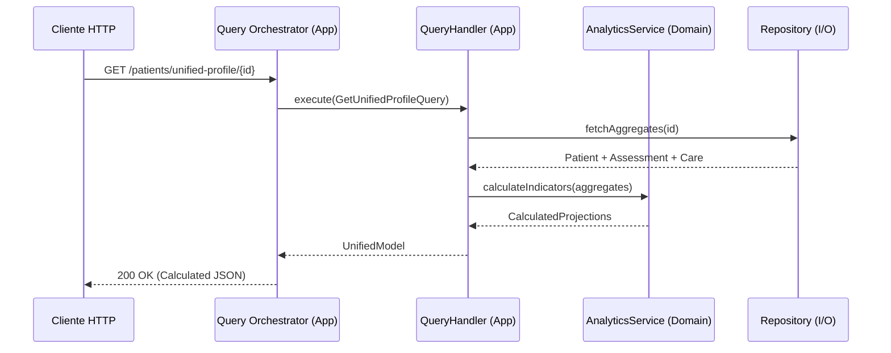

# Arquitetura — social-care (v2.0)

> Documento de referência arquitetural para o serviço `social-care`.
> Versão focada em **Domínio Analítico** e persistência **Metadata-Driven**.

---

## Índice

- [1. Contexto](#1-contexto)
- [2. Princípios Não Negociáveis](#2-princípios-não-negociáveis)
- [3. Camadas e Responsabilidades](#3-camadas-e-responsabilidades)
- [4. Lógica Analítica no Domínio (Inteligência Centralizada)](#4-lógica-analítica-no-domínio-inteligência-centralizada)
- [5. Estratégia de Dados: Tabelas de Domínio (Lookup)](#5-estratégia-de-dados-tabelas-de-domínio-lookup)
- [6. Query Orchestrator (Query Side)](#6-query-orchestrator-query-side)
- [7. Fluxo CQRS](#7-fluxo-cqrs)
- [8. Plano de Execução (Fases Atualizadas)](#8-plano-de-execução-fases-atualizadas)
- [9. Regras de Ouro](#9-regras-de-ouro)

---

## 1. Contexto

O `social-care` evoluiu de um simples cadastro para um **núcleo de inteligência social**. Ele processa dados brutos de triagem e gera indicadores analíticos (densidade habitacional, renda per capita, vulnerabilidades) em tempo real.

---

## 2. Princípios Não Negociáveis

| Princípio | Aplicação prática |
|---|---|
| **Inteligência no Domínio** | **Todos** os cálculos e projeções analíticas vivem no `Domain`. O Query Orchestrator nunca calcula, apenas solicita. |
| **PoP (Protocol-oriented)** | Dependências via protocolo. Uso intensivo de `Actors` para segurança em hardware dedicado. |
| **CQRS** | Segregação entre comandos de escrita e queries de projeção/leitura. |
| **Metadata-Driven** | Validações baseadas em metadados de tabelas de lookup, não em enums estáticos. |
| **CRU (No Delete)** | O sistema suporta apenas Create, Read e Update para garantir rastreabilidade histórica. |

---

## 3. Camadas e Responsabilidades

### Domain
- **The Core:** Contém a verdade sobre o que é uma família.
- **Analytics Services:** Serviços de domínio que recebem Agregados e retornam cálculos (ex: `FinancialAnalyticsService`).
- **Lookups:** Define os contratos de validação para IDs externos (Parentesco, Benefícios).

### Application
- **Command Handlers:** Executam alterações de estado garantindo regras de negócio (ex: "Apenas 1 Pessoa de Referência").
- **Query Handlers:** Orquestram a montagem de perfis complexos chamando os Analytics Services do Domínio.
- **Query Orchestrator:** Unifica múltiplos contextos em um único payload para o frontend.

### I/O (Infrastructure)
- **SQLKit Adapters:** Persistência relacional e consulta às tabelas de Lookup.
- **Vapor Controllers:** Exposição de endpoints REST seguindo os contratos unificados.

---

## 4. Lógica Analítica no Domínio (Inteligência Centralizada)

Diferente da v1, a v2 delega toda a matemática para o Domínio:

| Cálculo | Localização | Descrição |
|---|---|---|
| **Densidade Habitacional** | `HousingAnalytics` | `membros / dormitórios`. |
| **Renda Per Capita** | `FinancialAnalytics` | Cálculos RTF_S, RPC_S, RTG, RPC_G. |
| **Perfil Etário** | `FamilyAggregate` | Agrupamento por faixas (0-6, 7-14, etc). |
| **Vulnerabilidades** | `EducationAnalytics` | Identifica evasão escolar e analfabetismo por idade. |

---

## 5. Estratégia de Dados: Tabelas de Domínio (Lookup)

Para permitir mudanças de regras sem mexer no código, os campos de seleção usam **Tabelas de Domínio**:

- `dominio_parentesco`
- `dominio_tipo_ingresso`
- `dominio_tipo_beneficio` (Metadata-driven: indica se exige CPF ou Certidão)
- `dominio_tipo_violacao`

---

## 6. Query Orchestrator (Query Side)

O Query Orchestrator tem um papel fundamental na **Leitura (Read)**. Ele deve ser capaz de entregar o Prontuário Unificado:

```json
{
  "composicao": { "membros": [...], "perfil_etario": {...} },
  "analise_economica": { "renda_total": 0.0, "per_capita": 0.0 },
  "vulnerabilidades": { "habitacional": "...", "educacional": [...] }
}
```

---

## 7. Fluxo CQRS



---

## 8. Plano de Execução (Fases Atualizadas)

### Fase 5 — Infraestrutura de Metadados (Lookup)
- Criar migrações SQL para todas as tabelas `dominio_*`.
- Implementar `LookupRepository` e `LookupValidating` no domínio.
- Criar endpoints `GET /dominios/*` para o frontend.

### Fase 6 — Refatoração do Coração (Aggregates)
- **Registry:** Implementar regra de "PR Única" e VO de `DocumentosEntregues`.
- **Assessment:** Refatorar campos para usar UUIDs das tabelas de lookup.
- **Validação Cruzada:** Impedir internação de adolescentes se a família não tiver membros < 18 anos.

### Fase 7 — Implementação dos Analytics Services
- Criar os serviços de domínio para Renda, Habitação e Educação.
- Implementar a lógica de faixas etárias no Agregado de Família.

### Fase 8 — Query Orchestrator e CRU Completo
- Implementar Handlers de `GET` (Read Model) para todas as telas.
- Unificar o `POST /intake` para o novo payload de formulário completo.

---

## 9. Regras de Ouro

1. **Domínio Calculista:** Se envolve uma fórmula matemática ou contagem lógica, o código **deve** estar em `Domain/`.
2. **Integridade de Ciclo de Vida:** O sistema deve conhecer a idade dos membros para validar benefícios e medidas socioeducativas.
3. **Lookup Primeiro:** Nunca use uma String solta onde cabe um ID de tabela de domínio.
4. **Sem Deletes:** O histórico social é sagrado. Use flags de inativação se necessário, mas nunca `DELETE`.
5. **TDD Analítico:** Testes devem validar se as somas e divisões de renda/densidade estão corretas para casos de borda.
